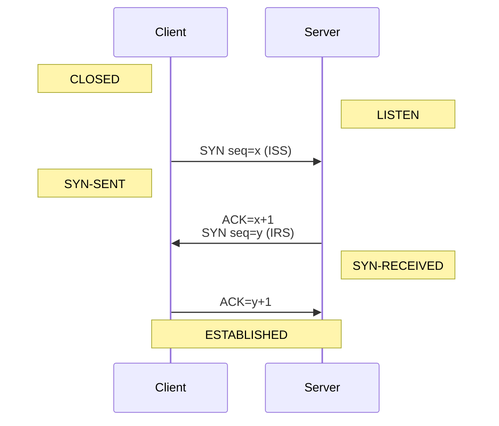

# Web

## Import Map

[Import Map][importmap] is a JSON that provides a mapping between the text used as the module specifier
in an `import` statement or `import()` operator

```html
<script type="importmap">
  {
    "imports": {
      "square": "./module/shapes/square.js",
      "circle": "https://example.com/shapes/circle.js"
    }
  }
</script>
```

## TCP

[TCP][tcpspec] is a bidirectional protocol (client sending request, server sending response).
Each direction of TCP can operate/be closed independently. HTTP is based on TCP.
A stream of data sent on a TCP connection is delivered reliably and in order at the destination.
Transmission is made reliable via the use of sequence numbers and acknowledgments.

```
Telnet, HTTP           <- application level
TCP                    <- host level
IP & ICMP              <- gateway level
Local Network Protocol <- network level
```

Connection happens in 3-way handshake:



Where `x` and `y` are picked randomly.
`ISS` – initial send sequence number.
`IRS` – initial receive sequence number.

`ACK` number – expected sequence number on the next packet.

```
SND.NXT +%= SEG.SEQ + SEG.LEN
```

Since the space is finite, all arithmetic dealing with sequence numbers must be performed modulo 2**32.

Why 3-way needed? Both client and server need to sync their `SEQ` numbers and `ACK` them.

```
    TCP A (Client)                                        TCP B (Server)
1.  CLOSED                                                LISTEN
2.  SYN-SENT    --> <SEQ=100><CTL=SYN>                --> SYN-RECEIVED
3.  ESTABLISHED <-- <SEQ=300><ACK=101><CTL=SYN,ACK>   <-- SYN-RECEIVED
4.  ESTABLISHED --> <SEQ=101><ACK=301><CTL=ACK>       --> ESTABLISHED
5.  ESTABLISHED --> <SEQ=101><ACK=301><CTL=ACK><DATA> --> ESTABLISHED
  ```

ACK does not occupy sequence number space (if it did, we would wind up ACKing ACK's!).

_note: tcp spec is so much better than any tutorial_

## HTTP

[HTTP][httpspec]

This will listen to the TCP on given port and then send some TCP message.
This message can be HTTP protocol mesage.

```sh
nc -l 42069
# and in other tab/window/session
curl localhost:42069
# or
echo "GET / HTTP/1.1\r\n\r\n" | nc localhost 42069
```

The term **CRLF** refers to Carriage Return (ASCII 13, \r) Line Feed (ASCII 10, \n).

### HTTP/2

[HPACK][hpack] - silent killer feature of http/2

[HPACK][hpackspec] is a header compression algorithm. Three methods of compression:
- static table (predefined, most commonly used, compressed in 1-2 bytes);
- dynamic table
  - only header name will be complressed in 1-2 bytes;
  - for repetetive headers (cookie for example) in consecutive requests, those values will be in this table;
- huffman encoding (everything else, compression is about ~30%);

## Etag

Used to save bandwidth and not to send huge payloads.
If content didn't change by given etag value – send 304, if changed – send content + 200.
Google Cloud supports it out of the box.

[tcpspec]: https://www.ietf.org/rfc/rfc793.txt
[httpspec]: https://www.ietf.org/rfc/rfc9110.txt
[importmap]: https://developer.mozilla.org/en-US/docs/Web/HTML/Element/script/type/importmap
[hpack]: https://blog.cloudflare.com/hpack-the-silent-killer-feature-of-http-2
[hpackspec]: https://httpwg.org/specs/rfc7541.html#static.table.definition
