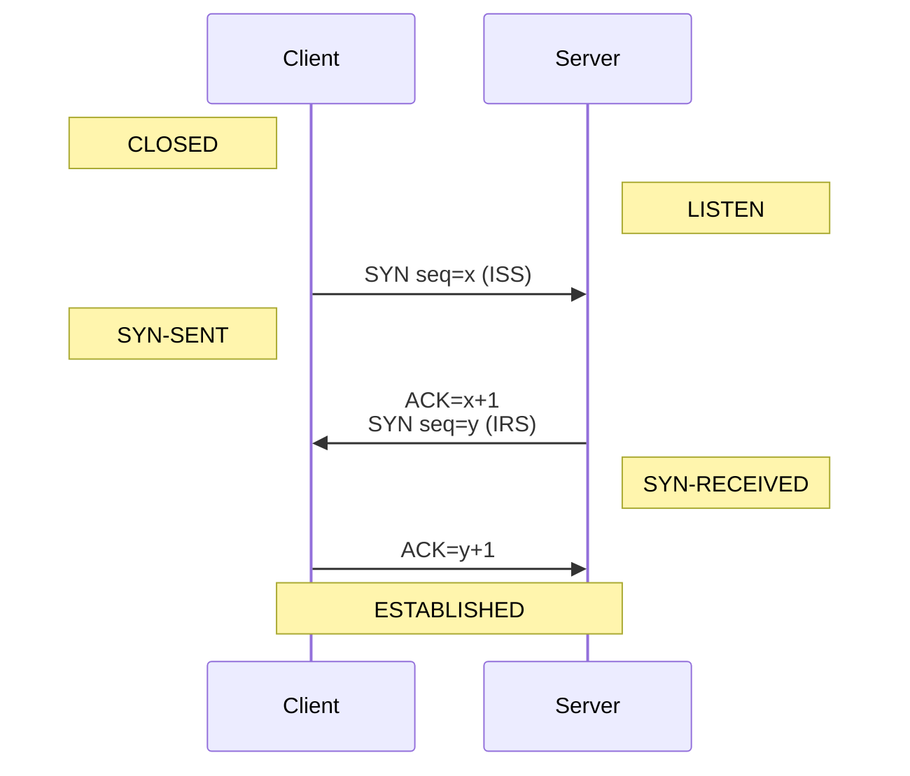

# Web

## Import Map

[Import Map][importmap] is a JSON that provides a mapping between the text used as the module specifier
in an `import` statement or `import()` operator

```html
<script type="importmap">
  {
    "imports": {
      "square": "./module/shapes/square.js",
      "circle": "https://example.com/shapes/circle.js"
    }
  }
</script>
```

## TCP

[TCP][tcpspec] is a bidirectional protocol (client sending request, server sending response).
Each direction of TCP can operate/be closed independently. HTTP is based on TCP.
A stream of data sent on a TCP connection is delivered reliably and in order at the destination.
Transmission is made reliable via the use of sequence numbers and acknowledgments.

```
Telnet, HTTP           <- application level
TCP                    <- host level
IP & ICMP              <- gateway level
Local Network Protocol <- network level
```

Connection happens in 3-way handshake:



Where `x` and `y` are picked randomly.
`ISS` – initial send sequence number.
`IRS` – initial receive sequence number.

`ACK` number – expected sequence number on the next packet.

```
SND.NXT +%= SEG.SEQ + SEG.LEN
```

Since the space is finite, all arithmetic dealing with sequence numbers must be performed modulo 2**32.

## Etag

Used to save bandwidth and not to send huge payloads.
If content didn't change by given etag value – send 304, if changed – send content + 200.
Google Cloud supports it out of the box.

[tcpspec]: https://www.ietf.org/rfc/rfc793.txt
[importmap]: https://developer.mozilla.org/en-US/docs/Web/HTML/Element/script/type/importmap
